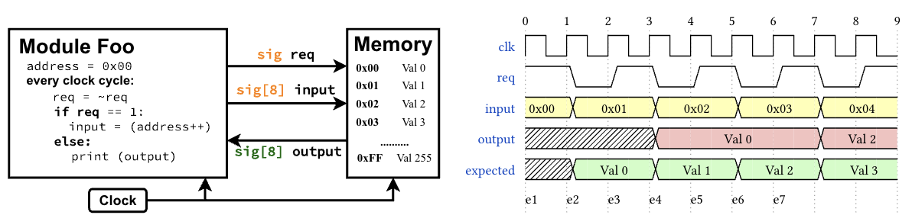

# Lesson 0: The HDL Primer

The hardware description workflow starts with writing the hardware description in an abstraction called RTL (Register Transfer Level). For example, if you want to describe a simple adder in the most widely used HDL, SystemVerilog, you would write:  

```verilog
module adder(
    input logic[7:0] a,
    input logic[7:0] b,
    output logic[7:0] sum
);
    assign sum = a + b;
endmodule
```

This is known as the **behavioral description** of the adder. There is also a **structural description**, where logic gates are used as the most atomic primitives to describe the hardware. However, that is beyond the scope of this discussion.  

At first glance, this SystemVerilog code might look like a regular software program. It appears as though we are assigning a value to an output reference in a function. But that is not the case.  

In software, you invoke a function using a call primitive, transferring control flow to it. In hardware description, however, module instantiation does **not** mean transferring control. Instead, it follows a **communication paradigm**—modules interact through signals (wires).


The signals are always connected and can be read anytime. The `assign` statement in the example above represents **continuous assignment**—meaning the value of `sum` is always the sum of `a` and `b`. There is no delay; the computation happens **immediately**. This is what is known as **combinational logic** in hardware.  

<div align="center">


</div>  

### Sequential Logic  

But what if happens when an component that takes multiple cycles to compute the output? For example, consider an 8-bit multiplier that computes the product using the shift and add logic:


```systemverilog
module shift_add_multiplier_8bit(
    input wire clk,
    input wire rst,
    input wire [7:0] multiplicand,
    input wire [7:0] multiplier,
    output reg [15:0] product
);
    // State definitions
    localparam IDLE = 2'b00;
    localparam CALC = 2'b01;
    localparam DONE = 2'b10;

    // Internal registers
    reg [1:0] state;
    reg [7:0] A;      // Upper part of product register
    reg [7:0] Q;      // Lower part of product register (contains multiplier)
    reg [7:0] M;      // Multiplicand storage
    reg [2:0] count;  // Counter (3 bits to count up to 8)
    
    assign product = {A, Q};

    always_ff @(posedge clk or negedge rst) begin
        if (!rst) begin
            state <= IDLE;
            A <= 0;
            Q <= 0;
            M <= 0;
            count <= 0;
            product <= 0;
        end 
        else begin
            case (state)
                IDLE: begin
                    A <= 0;
                    Q <= multiplier;
                    M <= multiplicand;
                    count <= 0;
                    state <= CALC;
                end
                
                CALC: begin
                    // Check LSB of multiplier (Q[0])
                    if (Q[0]) 
                        A <= A + M;  // Add multiplicand if the current bit is 1
                    
                    // Shift right {A, Q}
                    {A, Q} <= {1'b0, A, Q[7:1]};
                    
                    // Increment counter
                    count <= count + 1;
                    
                    // Stop after 8 cycles
                    if (count == 3'd7) 
                        state <= DONE;
                end
                
                DONE: begin
                    state <= IDLE;
                end
                
                default: state <= IDLE;
            endcase
        end
    end

endmodule
```

The `product` signal sources the registers `A` and `Q`. In HDLs, registers store state, while signals simply map values. In this case, `product` updates immediately whenever `A` or `Q` changes, which happens every cycle.

The shift-and-add multiplication logic is implemented inside an `always_ff` block. This block executes on the positive edge of `clk`. The `rst` signal resets the component.  

At the start of each cycle, assignments to registers take place. At the end of the cycle, the registers update. This models sequential logic in HDLs.  

The `case` statement defines the state machine, which has three states IDLE: Initializes registers, CALC: Performs multiplication over 8 cycles and DONE: Signals completion and resets the multiplier. 


Parsing this state logic might itself be tricky, but here are few important question:  

- **How does the top module know when the product is ready?**  
- **How does the multiplier module know when to start computing?**  
- **Without reading the implementation, can an interfacing module know this operation takes 8 cycles?** 


Consider the following example for instance, the `FOO` module sends a read request (`req`) and expects the response in the next cycle. However, the `Memory` module actually takes more than one cycle to process the request. 

<div align="center">



</div>

Since `FOO` is unaware of this delay, it reads the output too early, leading to incorrect or unexpected behavior. This mismatch in timing between modules causes invalid data to be observed.  

How can we ensure that:  
- Only **valid addresses** are looked up in memory?  
- The **address remains stable** while memory is being accessed?  
- The **interfacing module knows** when the data will be ready?  

These timing and validity constraints are crucial for hardware designs to avoid timing violations during runtime.

In simple terms, timing violations occur when:  

- A component reads a value before it is ready or after it has become invalid.
- A register storing a state is overwritten while still being used.

This results in unintended behavior across modules.


**Anvil** is designed to simplify writing RTL programs by providing higher-level language primitives that lift control to a more abstract level. At the same time, it still allows precise control over clock cycle latency in the circuit and **steps** in a state machine. Its type system ensures that your program both **conveys** and **respects** the intended behavior between interfacing components, reducing the risk of timing violations and unintended interactions.

---
[L1: Hello-World =>](../L1-Hello-World/README.md)